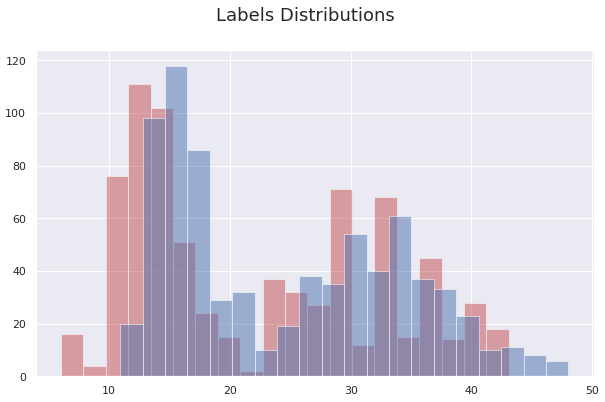
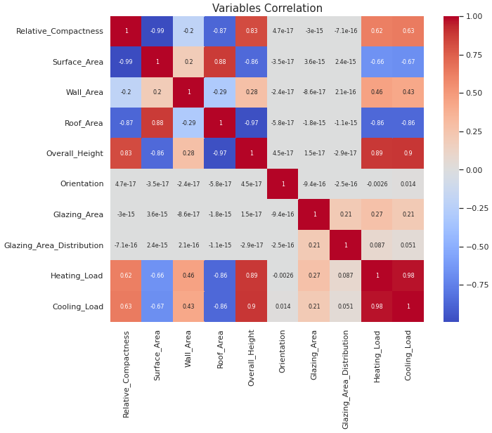
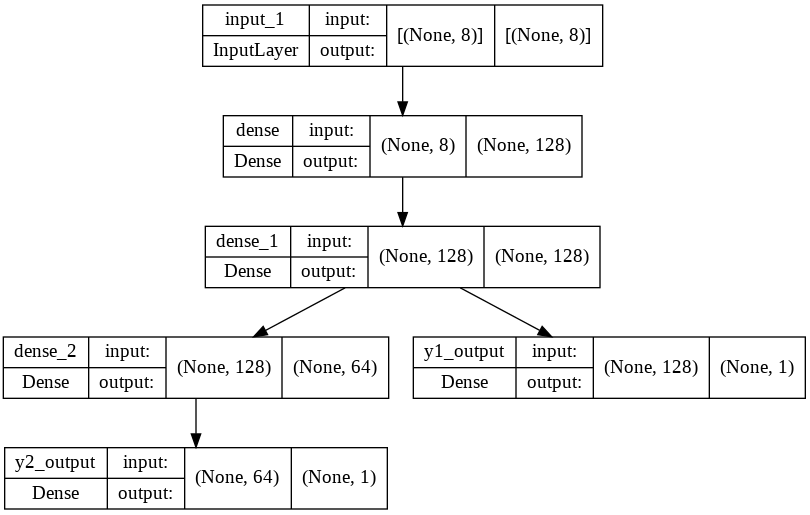
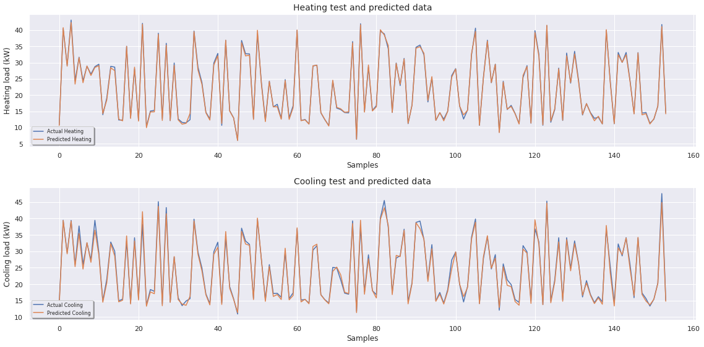

## Energy Efficiency Building Design 

### Project Overview
* Predicted the Cooling and Heating Load of different shaped buildings using a Multi-Output Convolutional Neural Network Model tuned with an SGD optimizer.
* Analized data distributions and correlations.
* Analyzed models error and residuals.

### Code and Resources Used 
**Python Version:** 3.7  
**Packages:** numpy, pandas, sklearn, matplotlib, seaborn, statsmodels.

### Dataset
The dataset is taken from the University of California, Irvine (UCI) Machine Learning Repository. It contains measure information (represented in 8 features) of 786 different buildings with their correspondant Heating and Cooling Load responses.

Dataset: https://archive.ics.uci.edu/ml/datasets/Energy+efficiency#

### EDA
* Features and Labels analysis and visualization.
* Correlation analysis.

Below are notebook captures as examples of our analysis:

  

### Data preparation
Data was splited into train (80%) and test (20%) sets and labels formated in tuples to train the Multi-Output Model.

### Models Building and Performance
A Multiple Output CNN with 2 and 3 layers with a SGD optimizer was trained: 

   
(notebook capture)

Obtaining the following results respectively:

* **CNN Output 1 (Heating Load)**: RMSE=0.4489. 
* **CNN Output 2 (Cooling Load)**: RMSE=0.9768.

  
(notebook capture)

### Metric chosen
**MSE** was used for the loss and **RMSE**  for the models output.

